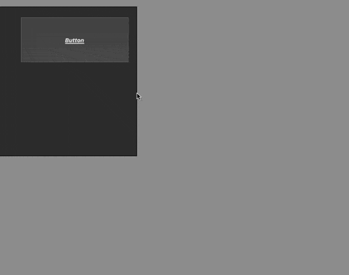

# TransmuteFormMacro

Transmute type of form object using form macro

Just right clic and choose the new type between among: `button`, `text`, `groupBox`, `input`, `list`, `listbox`, `combo`, `dropdown`, `picturePopup`, `button`, `pictureButton`, `buttonGrid`, `radio`, `checkbox`, `progress`, `ruler`, ` stepper`, `spinner`, `rectangle`, `line`, `oval`, `splitter`, `tab`

> ⚠️   there is no object properties sanity check: the object will keep all its properties even if not all are used with new type
 
